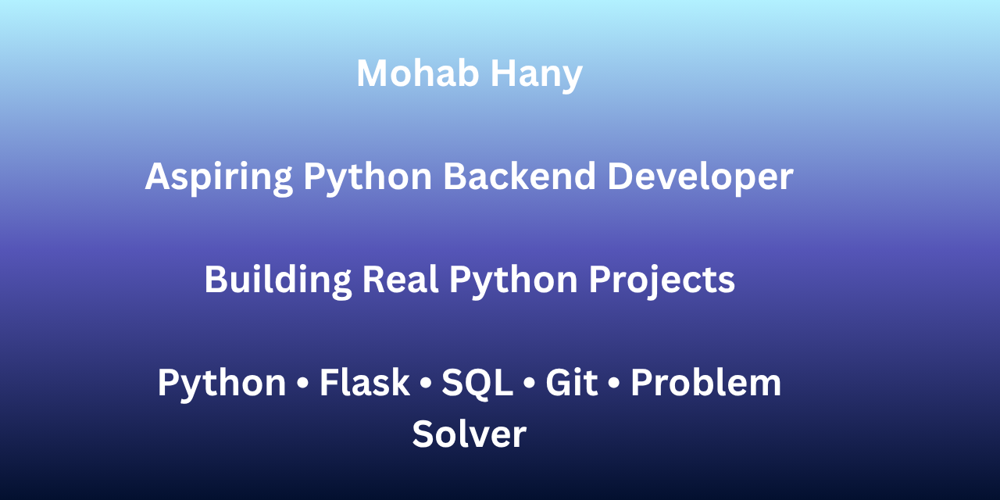

<h1 align="center">👋 Hi, I'm Mohab Hany</h1>
<h3 align="center">Python Developer | Backend Learner | Freelancer</h3>

  

---

### 🚀 About Me
- 🔭 I’m currently building **Python Projects**
- 🌱 I’m currently learning **Backend Development**
- 💬 Ask me about **Python, Web Scraping, APIs**
- 📫 How to reach me: **Open to Freelance Work**
- 🇪🇬 Based in **Egypt**

---

### 🛠️ Languages & Tools

 
 

 

---

### 📌 Featured Projects
- **Currency Converter**: Live exchange rates using Python + API
- **Website Scraper**: Extract data from websites using BeautifulSoup

---

### 📊 GitHub Stats

  

  

---

### 🤝 Connect With Me

Open to Freelance and Collaboration

